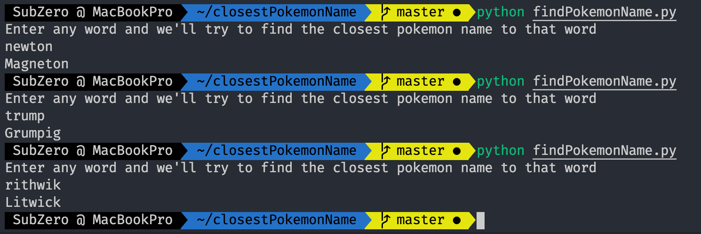

Just a simple fun app, that gives you the closest pokemon name, for whatever string you input. 

Credit goes to [sindresorhus](https://github.com/sindresorhus) for his [pokemon name collection](https://github.com/sindresorhus/pokemon/blob/master/data/en.json)  

and to [susanli2016](https://github.com/susanli2016) for her guide on the [fuzzywuzzy module](https://github.com/susanli2016/NLP-with-Python/blob/master/Fuzzy%20String%20Matching.ipynb)  

#### Basic Setup
Install the fuzzywuzzy python module   
<code>pip3 install fuzzywyzzy</code>

##### Next, just run the program with 
<code>python findPokemonNames.py</code>

##### A small example of how it works

